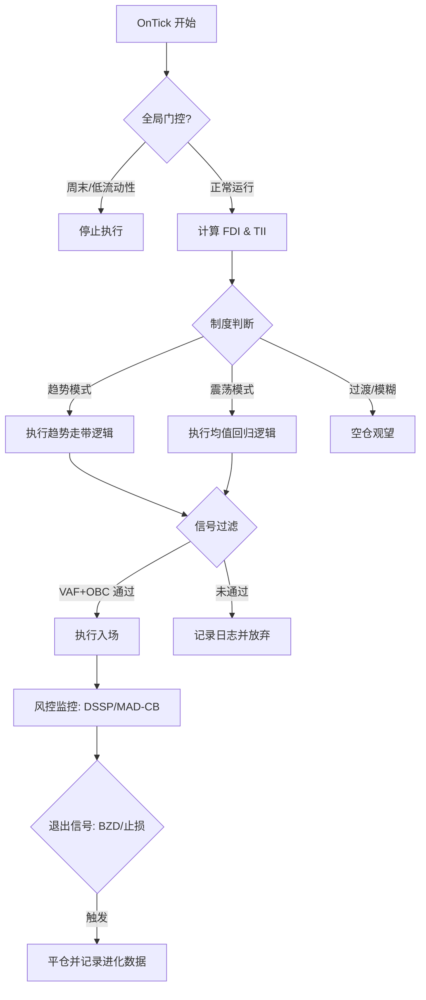

# 主权布林引擎 (SBE-2026) EA 实现技术规范报告

**报告编号**: EA-SPEC-2026-001
**版本**: v1.0 (Production Blueprint)
**日期**: 2026-03-08
**设计者**: StrategicianO (🧐)

---

## 1. 策略概览 (Strategy Overview)

**主权布林引擎 (Sovereign Bollinger Engine, SBE)** 是一套专为 2026 年复杂市场设计的自动化交易逻辑。其核心思想是：**不再寻找单一入场点，而是通过识别“市场制度 (Regime)”来动态切换交易模型。**

### 核心参数：
- **基准周期**: 20 SMA (动态调整)
- **标准差**: 2.0σ (动态调整)
- **主要目标**: 均值回归 (Mean Reversion) + 趋势走带 (Walking the Bands)
- **核心过滤器**: FDI, VAF, OBC

---

## 2. EA 架构设计 (Architecture)

EA 采用模块化设计，确保逻辑清晰且易于调试。

### 2.1 模块构成
1.  **Regime Oracle (制度识别模块)**: 判定市场处于趋势、震荡还是过渡期。
2.  **Signal Purifier (信号提纯模块)**: 执行 VAF、DABVR 和 OBC 过滤。
3.  **Execution Engine (执行引擎)**: 根据制度选择入场方式并应用 VRABBP 参数。
4.  **Risk Sentry (风险哨兵)**: 管理 DSSP 非对称止损和 MAD-CB 熔断。
5.  **Global Gating (全局门控)**: 处理时间窗、流动性及新闻过滤。

---

## 3. 详细逻辑分解 (Module Breakdown)

### 3.1 制度识别层 (Regime Logic)
EA 每根 K 线开盘时计算：
- **FDI (分形维数)**: 窗口 30 周期。
    - `FDI > 1.6`: 进入 `MEAN_REVERSION` 模式。
    - `FDI < 1.4`: 进入 `TREND_FOLLOWING` 模式。
    - `1.4 <= FDI <= 1.6`: 进入 `TRANSITION` (观望) 模式。
- **TII (趋势强度)**: 
    - `TII > 80`: 确认强趋势，仅允许顺势入场。
    - `TII < 20`: 确认震荡，允许双向逆势。

### 3.2 信号提纯层 (Filter Logic)
在入场前必须通过以下校验：
- **VAF (自相关性)**: 计算 BBW 的自相关系数。`VAF > 0.7` 才承认突破。
- **DABVR (波动率比)**: `ATR(5) / BBW(20) > 1.2` 触发突破警报。
- **OBC (订单块确认)**: 调用 H1 级别数据，检查当前价格是否位于 `H1_Order_Block` 范围内。

### 3.3 动态执行层 (Execution Logic)
应用 **VRABBP 协议**：
- 根据 `ATR Percentile` 自动选择：
    - **低波动**: SMA 10, 1.5σ (剥头皮模式)
    - **常规**: SMA 20, 2.0σ (标准模式)
    - **高波动**: SMA 30, 2.5σ (防御模式)

### 3.4 退出与风控层 (Risk Management)
- **DSSP (非对称止损)**: 
    - 多头: SL = 2.5σ 下轨；空头: SL = 1.5σ 上轨。
- **BZD (逃顶逻辑)**: 带宽 Z-Score 触顶回落（> 2.5 后下降）立即离场。
- **MAD-CB (熔断)**: 偏离均线 > 3.5σ 时，强制锁定盈利并禁止新开仓。

---

## 4. EA 运行流程图 (Operational Flow)



---

## 5. 关键代码段 (伪代码实现)

### 5.1 制度分类器
```cpp
ENUM_REGIME GetMarketRegime() {
   double fdi = calculateFDI(30);
   double tii = calculateTII(14);
   
   if(fdi < 1.4 && tii > 80) return REGIME_TREND_UP;
   if(fdi < 1.4 && tii < 20) return REGIME_TREND_DOWN;
   if(fdi > 1.6) return REGIME_MEAN_REVERSION;
   
   return REGIME_TRANSITION;
}
```

### 5.2 核心过滤逻辑
```cpp
bool IsSignalPure(ENUM_DIRECTION dir) {
   double vaf = calculateVAF(20);
   double dabvr = iATR(_Symbol, _Period, 5) / (upper - lower);
   bool ob_confluence = CheckOrderBlockConfluence(dir);
   
   if(vaf > 0.7 && dabvr > 1.2 && ob_confluence) return true;
   return false;
}
```

---

## 6. 实施建议与路线图 (Roadmap)

1.  **Phase 1 (回测验证)**: 在 MetaTrader 5 (MT5) 的策略测试器中，使用最近 6 个月的 1 分钟历史数据运行基于 FDI 的制度切换。
2.  **Phase 2 (参数调优)**: 重点优化 `FDI` 与 `VRABBP` 的配合，找到不同资产的最佳 ATR 分位点。
3.  **Phase 3 (模拟实盘)**: 在 Demo 账户运行 2 周，重点观察 **OBC (订单流确认)** 模块在实时行情中的延迟表现。
4.  **Phase 4 (正式部署)**: 开启每日自动反思 (`strategy_evolver.py`)，持续微调参数。

---

## 7. 结论

**主权布林引擎 (SBE)** 不是一个单一的算法，而是一套**分层的决策流水线**。通过将市场环境识别作为所有决策的“前哨站”，我们从根本上解决了传统 EA 在行情切换时出现的假突破和连续损单问题。

*StrategicianO (🧐) 签发*
*工程化确定性是量化的唯一基石。*
